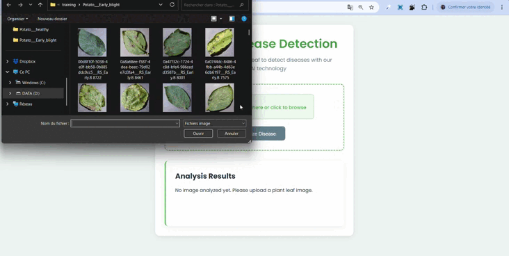

# 🥔 Potato Disease Classification Using CNN

## Overview

This project is a lightweight web application that uses a **Convolutional Neural Network (CNN)** to classify **potato leaf diseases** based on images. It’s built with:

- **TensorFlow/Keras** for training the model,
- A **FastAPI** backend for model inference, and
- A **pure HTML/CSS/JavaScript** frontend for uploading and testing images in real-time.

The application is trained on a labeled dataset and predicts one of the following classes:

- Potato___Early_blight
- Potato___Late_blight
- Potato___Healthy

---

## Features

- Upload a leaf image to classify its disease status
- High-accuracy CNN trained on the PlantVillage dataset
- Real-time disease prediction
- Frontend built with  HTML , CSS and JS 
- Organized model versioning (1, 2, 3)
- Simple and intuitive UI

---

## 🎥 Demo

Watch a complete demo of the system in action:

👉 


---

## Technologies Used

- **TensorFlow/Keras** – Deep Learning Model
- **FastAPI** – Lightweight Python API for model inference
- **HTML/CSS/JavaScript** – Frontend for user interaction
- **Jupyter Notebook** – Model training and preprocessing
- **PlantVillage Dataset** – Image dataset for training

---

## Installation

### 📦 Prerequisites

Make sure you have:

- Python 3.9 or later
- pip
- A virtual environment manager (`venv`)
- Node.js (optional, if you want to serve frontend with a server)

---

### ⚙️ Backend Setup

1. Clone the repository:

```bash
git clone https://github.com/bendhiamalak/PotatoDiseasesClassification.git
cd PotatoDiseasesClassification
```

2. Create and activate a virtual environment:
```bash
python -m venv venv
source .\venv\Scripts\activate on Windows
```

3.Install dependencies:
```bash
pip install -r requirements.txt
```

4.Start the FastAPI server:
```bash
uvicorn api.main:app --reload
```
The API will be available at: http://127.0.0.1:8000


## Usage
- Open the frontend (index.html)
- Upload an image of a potato leaf
- The app sends the image to the backend
- The backend loads the model and returns the prediction
- You see the disease classification in real-time


## Project Structure
```bash
PotatoDiseases/
├── api/
│   └── main.py                  # FastAPI backend
├── models/
│   ├── 1/                       # Model version 1
│   ├── 2/                       # Model version 2
│   └── 3/                       # Model version 3
├── PlantVillage/               # Dataset folders
│   ├── Potato___Early_blight/
│   ├── Potato___healthy/
│   └── Potato___Late_blight/
├── preprocessing.ipynb         # Notebook for preprocessing and training
├── index.html                  # Frontend HTML
├── requirements.txt
└── .gitignore
```

## Acknowledgements
Dataset: [PlantVillage on Kaggle](https://www.kaggle.com/datasets/arjuntejaswi/plant-village) 
TensorFlow and FastAPI communities
